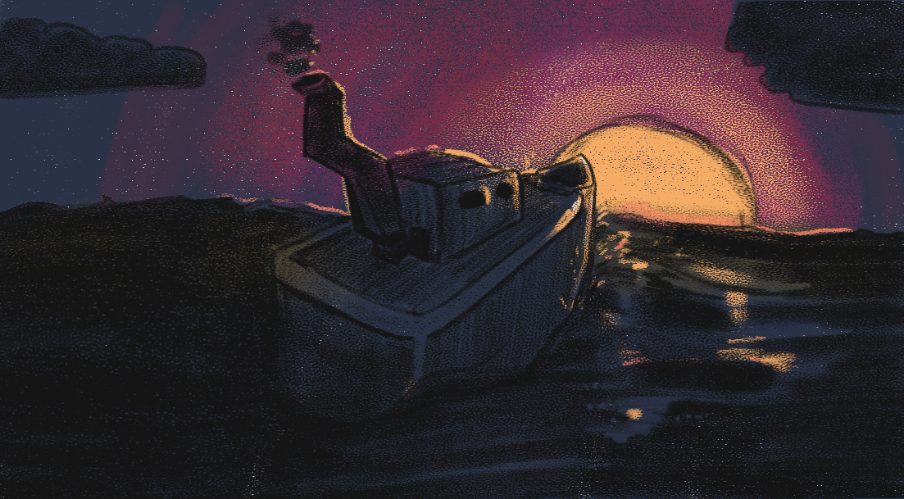
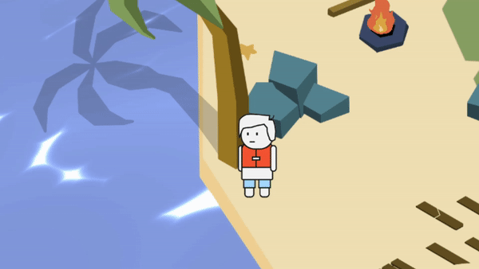
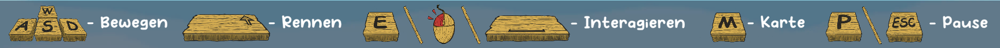
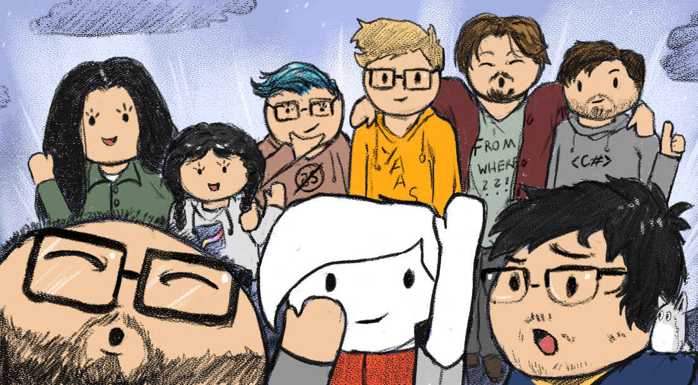

# OCEAN

An isometric, colorful Role Playing Game with scientific value made in Unity for
practical project course at The University of Applied Sciences (HTW) Berlin in Germany,
*thus the game is in german*.

After a shipwreck you find yourself on a tiny island surrounded by water. Luckily
someone from a nearby, bigger island noticed you floating there in your bright
life vest. They would like to bring you to the main island, as there is a ship
which might bring you home. You need to **earn** your spot on the boat,
so go and see what the island inhabitants have in store for you!

Your initial goal is getting home, but that might depend on what you call home.

## Scientific Value
This game was made as a gamification of personality tests, aiming to make
the process of these tests fun and context-rich, yet accurate. 

The point distribution and results are based on the Big Five Personality Markers
by Lewis R. Goldberg. These Five Markers are:
* **Openness:** how a person is open to new ideas
* **Conscientiousness:** self control, act dutifully
* **Extroversion:** energy creation from external means, being comfortable in public
* **Agreeableness:** general concern for social harmony
* **Neuroticism:** tendency to experience negative emotions

and they describe the base markers at which the human personality can be measured at.
(See [Wikipedia](https://en.wikipedia.org/wiki/Big_Five_personality_traits) or
[Goldberg's site](https://ipip.ori.org/) for more detailed information).

By adding all the points from the questions in the questionnaire or the quests in the game
respectively, you get a range of points which you can normalize and compare
(detailed [scoring instructions](https://ipip.ori.org/newScoringInstructions.htm)).

## How to Play (controls)
### Keyboard and Mouse
* Move with the WASD keys
* Press E, Spacebar or Left Mouse Button to interact with people
* Press M to open or close the map
* Make Choices and Navigate the UIs with the Mouse
* Hold Shift to move faster
  

## Built With
Software
* [Unity](https://unity3d.com/unity/whats-new/2020.3.21) - Unity Version 2020.3.21f1

Operating system
* Windows 10 64-Bit

## License
*Student's project for the module Practical Project as part of 
[International Media and Computing](https://https://imi-bachelor.htw-berlin.de/)
at [HTW Berlin](https://www.htw-berlin.de/).*

This Game has been distributed with Unity, 
[PlayFab](https://playfab.com/) and LeanTween.

## Team

* Abdulrahman Kassem
* Batul Iraki
* Billy Julian Lesmana
* Gino Georgiev
* Janik Schönberg
* Liz Kintzel
* Nico Mania
* Quynh Vi Trinh

## References
* [Unite Austin 2017 - Game Architecture with Scriptable Objects](https://www.youtube.com/watch?v=raQ3iHhE_Kk)
* [16Personalities - Personality Test](https://www.16personalities.com/free-personality-test)
* [Restful Coder - Dialogue System](https://www.youtube.com/c/RestfulCoder)
* [Unity Shader Graph - Cartoon Water & Foam Shader Tutorial](https://youtu.be/jBmBb-je4Lg)
* [Quest Goal | Making a Simple RPG - Unity 2017](https://youtu.be/up6HcYph_bo)
* [How to make a Simple Minimap](https://youtu.be/kWhOMJMihC0)

## Resources
#### Asset Store and Packages contents
1. Dented Pixel: [LeanTween](https://assetstore.unity.com/packages/tools/animation/leantween-3595)
2. Unity Technologies: [Cinemachine](https://unity.com/unity/features/editor/art-and-design/cinemachine)
3. Unity Technologies: [Universal RP](https://docs.unity3d.com/Packages/com.unity.render-pipelines.universal@11.0/manual/)
4. Unity Technologies: [InputSystem](https://docs.unity3d.com/Packages/com.unity.inputsystem@1.0/manual/Interactions.html#default-interaction)
5. Unity Technologies: [TMP](https://docs.unity3d.com/Manual/com.unity.textmeshpro.html)

#### Other Music & Sound contents
1. Universal UI Soundpack -
   Created and distributed by Nathan Gibson (https://nathangibson.myportfolio.com)
2. Stefan Kartenberg - Four Seasons (http://dig.ccmixter.org/files/JeffSpeed68/64153)

#### Other content
1. Microsoft: [PlayFab SDK](https://github.com/PlayFab/UnitySDK)
2. Tom Kail: [Displays the fields of a ScriptableObject in the inspector](https://gist.github.com/tomkail/ba4136e6aa990f4dc94e0d39ec6a058c)
